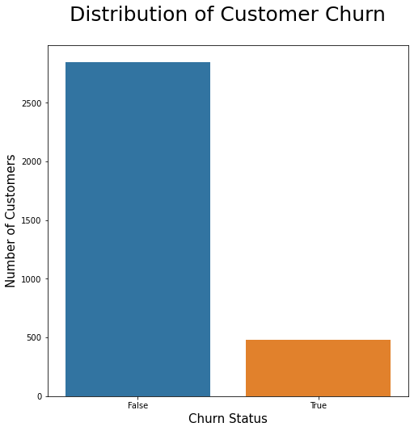
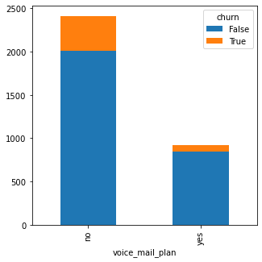
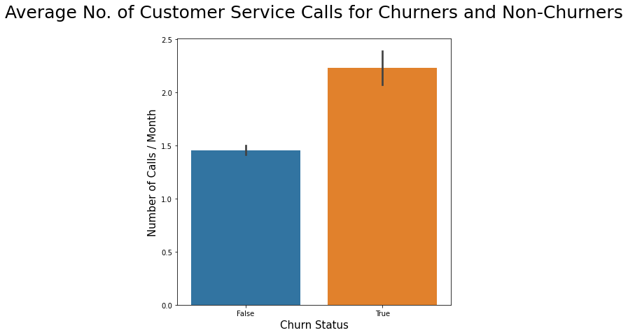
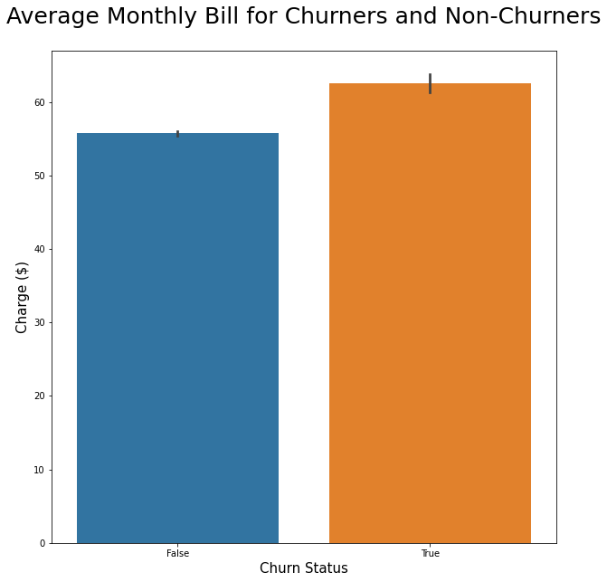
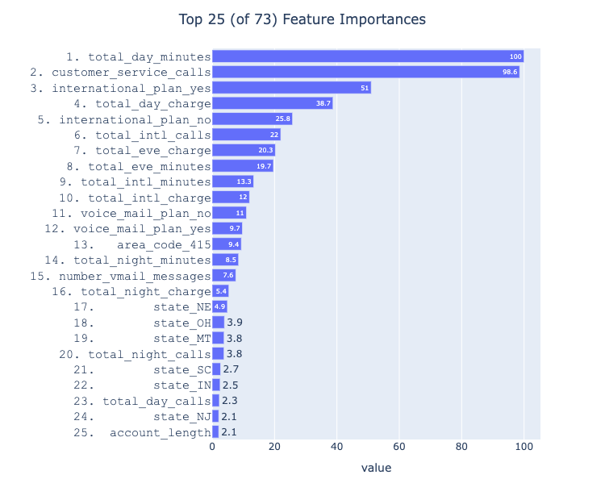

# Predicting Customer Churn Using SyriaTel Customer Churn Dataset

**Author**: [Ilan Haskel](mailto:ilanhaskel97@gmail.com)

## Overview

I used a dataset of United States customer usage habits from SyriaTel, a telecom company, to create a machine learning classification model that predicts customer churn with 95% accuracy. Many models were considered, but upon performance evaluation with an emphasis on accuracy and precision, a GradientBoostingClassifier was found to be the best model for the binary classification task. Feature Importance analysis as well as EDA found that the greatest indicators of customer churn are average number of customer service calls in a month and total minutes of phonetime during the day.

## Business Problem

Most telecom companies suffer from customer churn - the loss of customers to competition. This can be incredibly damaging to a company's profitability, as telecom companies spend hundreds of dollars to acquire new customers. When a customer leaves, the company is not only losing out on the future revenue that customer would bring in for the company, but also the considerable resources spent in acquiring the customer. Our goal was to create a machine learning model that can help predict whether a customer will churn given certain data about their usage, in order to be able to more efficiently direct customer retention efforts towards at-risk customers.

## Data Understanding

I used the SyriaTel Customer Churn dataset, found in the data folder of this repository. This is a public dataset that contains customer usage patterns and also includes a column delineating whether the customer has churned or not. It is unclear when exactly the data was collected, but it appears to have been made publicly available around 2012. Due to the nature of the 'churn' column, the dataset lends itself towards a binary classification problem, where a machine learning model can be constructed and trained on the data to predict whether a customer will churn or not given their usage patterns. The 'churn' column will be used as our target column in this binary classification problem.

## Exploratory Data Analysis

After some basic data cleaning and reformatting for clarity, I split the dataset into predictors and target for both more streamlined analysis and ultimately to use in the modeling process. EDA found that our target's distribution is fairly imbalanced, with only approximately 14% of the customers in the dataset belonging to the 'churn' class.



We later use SMOTE (Synthetic Minority Over-sampling Technique) to balance our classes.

EDA also found that a higher proportion of customers without a voicemail plan go on to churn when compared to those with a voicemail plan:



Customers who churned were also found to make a significantly higher amount of calls to customer service per month on average when compared to customers who did not churn in our dataset:



Finally, preliminary data analysis found that customers who churned were spending a higher average amount on their monthly phone bill when compared to customers who did not churn, possibly suggesting dissatisfaction with the cost of service:



## Modeling

Before doing anything else, I conducted a train/test split on the data in order to prevent leakage.

### Pipelines / ColumnTransformer

Pipelines (both SKLearn and ImbLearn) were used throughout the modeling process, but first for preprocessing as part of a ColumnTransformer. Numeric and categorical features were processed separately using pipelines, with our numeric features being standard scaled and our categorical features being OneHot-Encoded. I also label encoded our target to convert it from a boolean to a number for modeling usage. Both numeric and categorical pipelines were placed in a ColumnTransformer object for efficient use in subsequent modeling pipelines.

### ModelWithCV()

I also brought in a modeling class provided by Flatiron School that was used throughout the modeling process for more interpretable cross-validation. This was used regularly in order to evaluate each model iteration on validation subsets of our training data.

### Dummy / Baseline Model

SKLearn's DummyClassifier was used to construct a baseline model on which we would base subsequent model evaluation. This was brought into a pipeline containing our column transformer, fitted to our training data, cross-validated using Flatiron's ModelWithCV() class, and finally evaluated on test data. Our baseline model yielded a mean accuracy of approximately 85% when evaluated on test data.

### Logistic Regression

The first classification model I tried was logistic regression. Following all the same steps listed above, a simple logistic regression model yielded a mean accuracy score of approximately 86% when evaluated on test data, just slightly better than our baseline. At this point I added SMOTE to our pipeline structure to deal with the class imbalance. When running the same simple logistic regression model using SMOTE, we yielded a significantly lower mean accuracy on test data of approximately 78%. Nonetheless, SMOTE was included in every subsequent model pipeline in order to address class imbalance.

I then used GridSearch over our logistic regression pipeline for hyperparameter-tuning, hoping to improve on our mean accuracy score. This proved unfruitful, as our base logistic regression model pre-SMOTE still yielded the best accuracy score.

### Random Forest Classifier

The next model I tried was a random forest algorithm. A default random forest classifier following all the same preprocessing and evaluation steps above (including SMOTE) performed significantly better, yielding a mean accuracy score of approximately 93.6% on test data, as well as a precision score of approximately 70%. I decided to consider precision as a supplementary metric to accuracy, as the business cost of false positives (spending money to retain customers who were already planning on staying) is significant and worth trying to minimize.

After grid searching and tuning some hyperparameters, I was able to slightly improve our RFC model's performance to a mean accuracy score of approximately 94.1% while keeping a precision score of approximately 70%.

### Gradient Boosting Classifier

The final model I tried was a gradient boosting classifier. Following all the same steps as with our previous models, I found a hyperparameter-tuned gradient boosting classifier to perform the best on test data with respects to both of our important classification metrics. Evaluation on test data yielded a mean accuracy score of approximately 96% and a precision score of 80%, outperforming our previous best model on both accounts.

### Performance Metric Justification

Precision is important because it answers the question of how many often our model's prediction of the positive class was actually correct. In this case, the positive class is customers who churned. Precision as a metric is highly sensitive to false positives - when our model predicts that a customer will churn when they actually will not. This is crucial because any telecom company will want to minimize the amount of money being spent on uncessary retention efforts. It is quite expensive to provide targeted incentives for a customer to stay, such as price breaks or discounts, so it is important for our model to be confident that the customers it predicts to churn are actually at risk of churning.

That said, it is also important for our model to be generally confident in its predictions across both classes. Even though it might be a more expensive mistake in the short term to needlessly incentivize a customer to stay, we must not undervalue the long-term profitability loss month-over-month in losing a loyal customer to competition. For this reason, mean accuracy (as we have been prioritizing) may be just as important, if not more important, than precision when evaluating our classifier.

## Interpretation - Feature Importance

In order to tease out which features our model determined to be most important in classifying churn, I needed to pull out its feature importances. This provided a challenge, as our model is baked into a pipeline that includes a ColumnTransformer, making it a significant challenge to extract the names of the features used. To remedy this issue, I brought in a class created by Kyle Gilde (LinkedIn and class provided in the notebook), that allowed us to extract these features with their names and plot them based on relative importance:



It is worth noting that this class only provides relative feature importances for our model, meaning it does not allow for objective interpretation of the impact a particular feature has on the probability a data point belongs to our target class. Instead, it allows us to compare amongst all our used features. Pulling out the top 25 most important features, we can see that total_day_minutes and customer_service_calls are weighed the most heavily in our model by a significant margin. We can interpret this graph using total_day_minutes as our 'gold standard' for importance, as it is deemed the most important and therefore is given a value of 100. In comparison, we can say that customer_service_calls was 98.6% as important as total_day_minutes to our model, and similarly international_plan_yes was 51% as important as total_day_minutes.

## Next Steps

Further hyperparameter-tuning can be done in order to optimize accuracy and precision scores to arrive at the best possible model for our given business problem. Furthermore, it would be useful to have more current data, as the dataset used to train and test our model is from 2012.

## For More Information   

See the full analysis in the [Jupyter Notebook](./index.ipynb).

**For additional info, contact:**
- Ilan Haskel: ilanhaskel97@gmail.com

## Repository Structure

```
├── data
│   ├── bigml_59c28831336c6604c800002a.csv
├── images
│   ├── bill.png
│   ├── churn_distribution.png
│   ├── header.jpg
│   ├── importance.png
│   ├── service.png
│   └── voicemail.png
├── .gitignore
├── README.md
├── index.ipynb
└── presentation.pdf
```
